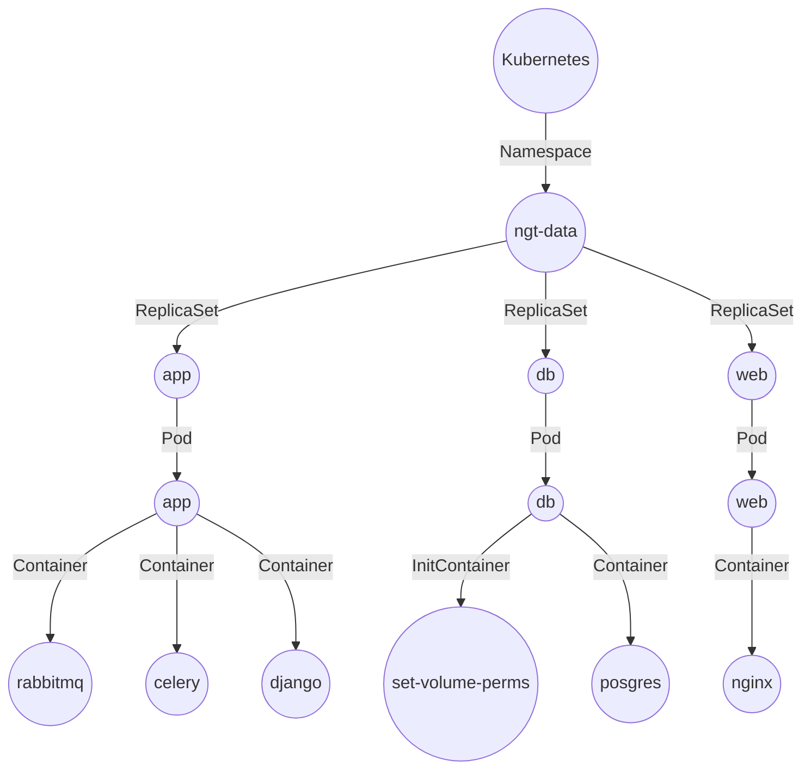

# Helm Chart

Next-Generation Ecosystem Experiments–Tropics (NGEE-Tropics) is a DOE-funded,
multi-institutional project led by Berkeley Lab, focused on how
tropical forests interact with Earth’s climate. This helm chart deploys the 
The NGEE-Tropics archive service sits in the middle of the *NGEE Tropics data workflow*.

* Place to upload datasets and metadata.
* Datasets should consist of related data collections, not individual files (e.g. Sapflow collected at Manaus)
* Datasets will receive a DOI, and can be updated with new data.
* Datasets will be available for search to NGEE Tropics team, and (if policy allows) to public
* Makes NGEE-Tropics compliant with DOE Data Management Plan


## Get Access

```bash
$ helm repo add ngt-archive https://ngeet.github.io/ngt-archive/charts/
$ helm search repo ngt-archive
```

## Introduction

This chart bootstraps a **NGEE-Tropics Archive** deployment on either a [Kubernetes](http://kubernetes.io) 
or [Rancher](https://rancher.com/) cluster using the [Helm](https://helm.sh) package manager.

## Installing the Chart

To install the chart with the release name `<release name>`:

```bash
$ helm upgrade --install <release name> ngt-archive/ngt-archive
```

The command deploys ESS-DIVE Fusion Database on the Kubernetes cluster in the default configuration. 

> **Tip**: List all releases using `helm ls`

## Uninstalling the Chart

To uninstall/delete the `<release name>` deployment:

```bash
$ helm delete <release name>
```

The command removes all the Kubernetes components associated with the chart and deletes the release.


## Configuration

The following table lists the configurable parameters of the ESS-DIVE Fusion Db chart and their default values.

| Parameter                | Description             | Default        |
| :----------------------- | :---------------------- | -------------- |
| `ka8.creatorId` |  Kubernetes user id | `""` |
| `k8.clustername` |  Kubernates cluster name | `""` |
| `uid` |  User id of the ngt-archive containers | `""` |
| `gid` |  Group id of the ngt-archive containers | `""` |
| `readOnly` |  Is the archive in read-only mode?  | `"false"` |
| `teamEmail` | The email address for the - No Reply <no-reply@noreply.gov>  | `""` |
| `celeryConcurrency` | The concurrency number for the celery worker  | `3` |
| `emailSubjectPrefix` |  Subject prefix for emails sent by the application | `""` |
| `image.repository` | docker image for this helm chart | `"registry.nersc.gov/m2690/ngt-archive"` |
| `image.tag` | docker image tag. Overrides the image tag whose default is the chart appVersion. | `""` |
| `imagePullSecrets` | Global registries for image pull secrets | `[]` |
| `nameOverride` | overrides ngt-archive.name template | `""` |
| `fullnameOverride` | The name of the service account to use. If not set and create is true, a name is generated using the fullname template | `""` |
| `restore.importFile` | Restore from a backup. Set the name of the file to import. | `""` |
| `secretName.application` | Application secrets (auth-bind-ldap-password, google-maps-key, secret-key) | `""` |
| `secretName.database` |  Database Password (db-password) | `""` |
| `secretName.certificate` | The secret that points to the certificate for this deployment (ngt-data) | `""` |
| `volume.dbClaim` | Postgres db volume name (change this name when restoring from backups) | `""` |
| `volume.backupDirectory` | the postgres db backup directory | `""` |
| `volume.importDirectory` | the directory under the backup to import (e.g. 20221016T230006) | `""` |
| `volume.dataDirectory` | directory where archive data is stored | `""` |
| `volume.dataImportDirectory` | directory where archive data is imported from | `""` |
| `ingress.name` | Name of the ingres. (Defaults to fullname) | `""` |
| `ingress.enabled` | manage external access to services (https://kubernetes.io/docs/concepts/services-networking/ingress/) | `false` |
| `ingress.annotations` | annotations for this ingress | `{}` |
| `ingress.hosts` | list of hosts for the ingress | `[{"host": "chart-example.local", "paths": []}]` |
| `ingress.tls` | transport layer security | `[]` |
| `env` | environment variables for deployment | `"[]"` |
| `web.serverName` | The server name of this host | `"localhost"` |
| `web.realIp.enabled` | enable configuration for real ips | `false` |
| `web.realIp.fromIps` | the list subnet addresses to accept real ips from (e.g. [ '10.42.0.0/16', '144.44.138.155/25' ]) | `[]` |
| `web.locations.root` | root location declarations (e.g. `[{"name": "proxy_set_header", "value": "X-Forwarded-Proto https", "comment": "Set protocol to HTTPS"}]`) | `[]` |

    
### Examples
The examples below are minimal installations. You will likely need to configure more parameters. 

Basic installation.

```bash
$ helm install <release name> ngt-archive/ngt-archive
```
## Services on Kubernetes



## People

+ [Contributors](https://github.com/NGEET/ngt-archive/graphs/contributors)

## Copyright

NGEE Tropics Archive (NGT Archive) Copyright (c) 2017, The
Regents of the University of California, through Lawrence Berkeley National
Laboratory (subject to receipt of any required approvals from the U.S.
Dept. of Energy).  All rights reserved.

If you have questions about your rights to use or distribute this software,
please contact Berkeley Lab's Intellectual Property Office at
IPO@lbl.gov.

NOTICE.  This Software was developed under funding from the U.S. Department
of Energy and the U.S. Government consequently retains certain rights.  As
such, the U.S. Government has been granted for itself and others acting on
its behalf a paid-up, nonexclusive, irrevocable, worldwide license in the
Software to reproduce, distribute copies to the public, prepare derivative
works

# License

```
NGEE Tropics Archive (NGT Archive) Copyright (c) 2017, 
The Regents of the University of California, through 
Lawrence Berkeley National Laboratory (subject to receipt of any required 
approvals from the U.S. Dept. of Energy).  All rights reserved.

Redistribution and use in source and binary forms, with or without
modification, are permitted provided that the following conditions are met:

(1) Redistributions of source code must retain the above copyright notice,
this list of conditions and the following disclaimer.

(2) Redistributions in binary form must reproduce the above copyright
notice, this list of conditions and the following disclaimer in the
documentation and/or other materials provided with the distribution.

(3) Neither the name of the University of California, Lawrence Berkeley
National Laboratory, U.S. Dept. of Energy nor the names of its contributors
may be used to endorse or promote products derived from this software
without specific prior written permission.


THIS SOFTWARE IS PROVIDED BY THE COPYRIGHT HOLDERS AND CONTRIBUTORS "AS IS"
AND ANY EXPRESS OR IMPLIED WARRANTIES, INCLUDING, BUT NOT LIMITED TO, THE
IMPLIED WARRANTIES OF MERCHANTABILITY AND FITNESS FOR A PARTICULAR PURPOSE
ARE DISCLAIMED. IN NO EVENT SHALL THE COPYRIGHT OWNER OR CONTRIBUTORS BE
LIABLE FOR ANY DIRECT, INDIRECT, INCIDENTAL, SPECIAL, EXEMPLARY, OR
CONSEQUENTIAL DAMAGES (INCLUDING, BUT NOT LIMITED TO, PROCUREMENT OF
SUBSTITUTE GOODS OR SERVICES; LOSS OF USE, DATA, OR PROFITS; OR BUSINESS
INTERRUPTION) HOWEVER CAUSED AND ON ANY THEORY OF LIABILITY, WHETHER IN
CONTRACT, STRICT LIABILITY, OR TORT (INCLUDING NEGLIGENCE OR OTHERWISE)
ARISING IN ANY WAY OUT OF THE USE OF THIS SOFTWARE, EVEN IF ADVISED OF THE
POSSIBILITY OF SUCH DAMAGE.

You are under no obligation whatsoever to provide any bug fixes, patches,
or upgrades to the features, functionality or performance of the source
code ("Enhancements") to anyone; however, if you choose to make your
Enhancements available either publicly, or directly to Lawrence Berkeley
National Laboratory, without imposing a separate written license agreement
for such Enhancements, then you hereby grant the following license: a
non-exclusive, royalty-free perpetual license to install, use, modify,
prepare derivative works, incorporate into other computer software,
distribute, and sublicense such enhancements or derivative works thereof,
in binary and source code form.
```
